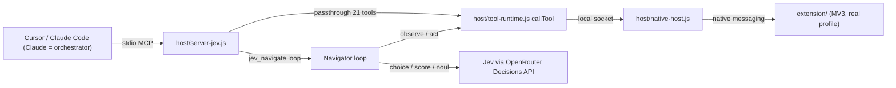

# PRD: Jev decision layer for Open Claude in Chrome

- **Status:** Draft
- **Date:** 2026-09-25
- **Owner:** Alexandre Lam

## 1. Summary

Add a new MCP server variant, `host/server-jev.js`, that lets an orchestrating
LLM (Claude, running in Cursor or Claude Code) hand a bounded browser subgoal to
TypeSafe's **Jev** decision model. Jev picks each next action (which operation,
which element), and this repo's existing extension carries it out in the user's
**real, logged-in Chromium profile**. Claude keeps planning, supplies any text to
type, and verifies outcomes. Jev removes the per-click LLM round trip.

The extension and native host do not change. All new work lives in `host/`.

## 2. Background

- **Open Claude in Chrome** (this repo) exposes 21 browser tools over MCP. It drives
  the user's real browser through an MV3 extension, so it works with the user's
  existing logins and doesn't need a debugging port.
- **Jev** (TypeSafe AI, released 2026-09-15) is a "System One" decision model. You
  give it state plus typed questions (`choice`, `noul` for yes/no, `score`), and it returns
  a choice with a calibrated probability. It never generates text, selectors,
  coordinates or code. Reported cost is about $0.042 per million input tokens.
  Jev is also available on OpenRouter as `~typesafe/jev-latest`, through the
  Decisions API.
- **Existing Jev browser projects** (`jev-ultrafast`, `@jkudish/jev-browser`,
  `ChenYCL/jev-browser-skill`, `vlad-terin/jev-browser`, `jev-ra`) all either start
  their own Playwright Chromium or attach over CDP (`--remote-debugging-port`).
  Since Chrome 136, CDP attach doesn't work on the default profile. **None of them
  can drive the user's everyday browser.** This repo can, and that is the gap this
  PRD fills.

## 3. Problem

Today every browser step costs a full orchestrator turn: take a screenshot or read
the page, reason, act, repeat. The repo's own benchmark shows context is the main
source of latency (+1.9s per turn per 100k tokens), and a typical task takes about
30 turns. Most of those turns are mechanical choices ("click the Search button")
that don't need a frontier LLM.

## 4. Goals and non-goals

### Goals

1. Claude can delegate a subgoal ("open the latest invoice", "filter to last 30
   days") in **one tool call**, and get back a structured result.
2. Jev makes each step's decision. The extension carries out the action on the
   real profile.
3. Fewer orchestrator turns and less wall-clock time than the default server on
   the same tasks, with no loss in accuracy.
4. Deterministic safety: actions are only taken on elements the harness actually
   observed, sensitive actions are gated, and there are step, time and budget caps.
5. Works in **Cursor** and Claude Code with no extension changes.

### Non-goals (v1)

- Replacing Claude for planning, reading page content, or typing free-form text.
- Vision. Jev works from structured page state, and screenshots stay with Claude.
- Canvas, WebGL, or cross-origin iframe-only UIs.
- Changes to the extension, the native host, or the recording/channel features.
- Running Jev inside `execute_code` (possible later, see section 12).

## 5. Users and primary use cases

- **Developer in Cursor** automating repetitive flows on sites where they're logged
  in (dashboards, admin panels, SaaS tools).
- **Data gathering across many similar pages**, where the same click patterns repeat.
- **Multi-step forms** where Claude provides the values and Jev picks the fields
  and controls.

## 6. Solution overview



The division of work:

- **Claude** breaks down the task, calls `jev_navigate` with a goal, text values and
  a stop condition, checks the result, and handles `needs_help` escalations with
  the normal 21 tools.
- **Jev** picks one operation and one target per step from a bounded, indexed
  action space.
- **The harness** (`server-jev.js`) observes the page, builds the action space,
  checks Jev's choice, runs the action, verifies the result, and enforces limits.
- **The extension** executes the action (humanize and audit modes still apply,
  because the loop goes through the same tools).

## 7. Functional requirements

### 7.1 New server: `host/server-jev.js`

- Stdio MCP server with the same process lifecycle as
  [host/mcp-server.js](host/mcp-server.js): `init()` and `callTool()` from
  [host/tool-runtime.js](host/tool-runtime.js), `watchParent()` from
  [host/parent-watch.js](host/parent-watch.js), and signal/EOF cleanup.
- Calls `callTool` **in-process**, not through a child `mcp-server.js`, so the
  loop avoids an extra stdio hop.
- Exposes the 21 existing tools unchanged (from
  [host/tool-definitions.js](host/tool-definitions.js)) plus the new tools below.
- Registered in Cursor like the other servers:

```json
{
  "mcpServers": {
    "open-claude-in-chrome-jev": {
      "command": "node",
      "args": ["/abs/path/host/server-jev.js"],
      "env": { "OPENROUTER_API_KEY": "sk-or-v1-..." }
    }
  }
}
```

### 7.2 Tool: `jev_navigate`

Input:

| Field | Type | Required | Notes |
|---|---|---|---|
| `goal` | string | yes | The subgoal in natural language |
| `tabId` | number | yes | Must be in the MCP tab group |
| `success_criteria` | string | yes | Observable condition, checked by a Jev `noul` question after each step |
| `values` | object `{label: string}` | no | Text Claude provides. Jev picks which value goes in which field |
| `start_url` | string | no | Navigate here first |
| `max_steps` | number | no | Default 20, hard cap 50 |
| `max_ms` | number | no | Default 60000 |
| `min_confidence` | number | no | Default 0.6. Below this, the loop escalates instead of acting |
| `allow_sensitive` | boolean | no | Default false. See 7.5 |

Output (JSON text plus `structuredContent`):

- `status`: `done` \| `needs_help` \| `needs_value` \| `blocked` \| `limit_reached`
- `steps`: `[{ i, operation, target_ref, target_label, confidence, ms }]`
- `final_url`, `final_title`
- `reason` (when not `done`), including the field label and role for `needs_value`
- `page_excerpt`: short interactive summary of the final page, so Claude can
  continue without calling `read_page` again
- `usage`: Jev request count, tokens and estimated cost

### 7.3 Tool: `jev_decide` (single step, advisory)

Same observation and decision as one loop step, but **it doesn't act**. It returns
the proposed operation, target and probability distribution. This is for debugging
and for Claude to check Jev's choice before committing.

### 7.3b Jev provider: OpenRouter Decisions API

v1 calls Jev through OpenRouter's Decisions API. One OpenRouter key covers both
Jev and any OpenRouter-routed text model, and billing is in one place.

- **Endpoint:** `POST https://openrouter.ai/api/alpha/decisions`
- **Auth:** `Authorization: Bearer $OPENROUTER_API_KEY`
- **Optional headers:** `HTTP-Referer`, `X-Title` (only affect OpenRouter rankings)
- **Model:** `~typesafe/jev-latest` always points to the newest Jev (currently
  Jev 1.13). Production pins a versioned slug and uses `-latest` only in dev.
- **SDK:** `@openrouter/sdk` → `openrouter.alpha.decisions.create({ decisionsRequest })`,
  or plain `fetch`. v1 uses `fetch` so there's no new dependency.
- **Jev doesn't generate text.** It answers typed questions about a `state`
  (a string, object or array) and returns calibrated probabilities.

Question types:

| Type | Request `criteria` | Answer |
|---|---|---|
| `noul` | `{ true: "...", false: "..." }` | `noul`: probability 0..1 of "yes" |
| `choice` | `{ key: "description", ... }` | `choice`: chosen key, plus `probabilities` over all keys |
| `score` | ordered array `["Low", "Mid", "High"]` | `score`, plus the distribution over the scale |

One navigator step as a request:

```json
{
  "model": "~typesafe/jev-latest",
  "state": {
    "goal": "Open the most recent invoice",
    "success_criteria": "An invoice detail page is shown",
    "url": "https://app.example.com/billing",
    "title": "Billing",
    "elements": [
      "e1 | link | Invoices",
      "e2 | button | Download",
      "e3 | textbox | Search | value=\"\""
    ],
    "values": ["search_term"]
  },
  "questions": {
    "operation": {
      "type": "choice",
      "instructions": "What operation should the browser agent take next?",
      "criteria": {
        "CLICK": "Activate an observed link, button or control",
        "TYPE_TEXT": "Enter text into an editable field",
        "SCROLL_DOWN": "Reveal more of the page",
        "DONE": "The goal is already satisfied",
        "BLOCKED": "No offered operation can advance the goal"
      }
    },
    "target": {
      "type": "choice",
      "instructions": "If the operation acts on an element, which one?",
      "criteria": { "e1": "link: Invoices", "e2": "button: Download", "e3": "textbox: Search" }
    },
    "value_key": {
      "type": "choice",
      "instructions": "If typing, which provided value belongs in the target field?",
      "criteria": { "search_term": "The user's search term", "NONE": "No provided value fits" }
    },
    "sensitive": {
      "type": "noul",
      "instructions": "Would this action have a destructive or irreversible effect?",
      "criteria": { "true": "Pays, deletes, sends, publishes or submits", "false": "Safe to undo" }
    }
  }
}
```

The harness reads `answers.operation.choice` and `answers.target.choice`,
and treats `max(probabilities)` as the confidence. `answers.sensitive.noul` is
compared with a threshold (default 0.5). The element IDs `eN` map back to
`read_page` refs `ref_N` inside the harness. Jev never sees or returns a ref it
wasn't given.

### 7.4 The navigator loop

Each step:

1. **Observe.** `callTool("read_page", { tabId, filter: "interactive" })`. Parse each
   line (`role "name" [ref_N] href=... value=... type=... disabled ...`) into rows.
   Drop disabled and duplicate rows. Add URL, title, and a short
   `get_page_text` excerpt as state.
2. **Size the action space.** If there are more than about 120 rows or the token
   budget is exceeded, run a parallel Jev **Score** pass over page sections, then keep
   the top sections. Follow the `split/shortlist/reduce` approach from
   `vlad-terin/jev-browser` (`src/selector.mjs`, `src/split.mjs`). Anything cut
   can't be selected, and this is recorded in the step log.
3. **Decide.** Send one Jev request with parallel questions:
   - `operation` (Choice): only the operations the page supports, from
     `CLICK, TYPE_TEXT, SELECT, SCROLL_UP, SCROLL_DOWN, WAIT, DONE, BLOCKED`
   - `target` (Choice): the indexed rows that fit the chosen operation
   - `value_key` (Choice): keys of `values`, plus `NONE`, used only for TYPE_TEXT/SELECT
   - `sensitive` (noul): is this a destructive or irreversible action?
4. **Validate** (deterministic, never skipped):
   - the target ref appears in *this* observation
   - the operation and element role are compatible
   - confidence is at least `min_confidence`, otherwise return `needs_help`
   - `sensitive && !allow_sensitive` returns `needs_help`
   - TYPE_TEXT with `value_key = NONE` returns `needs_value`
5. **Act**, using existing tools only:

| Jev operation | Tool call |
|---|---|
| CLICK | `computer { action: "left_click", ref }` |
| TYPE_TEXT | `computer { action: "triple_click", ref }` then `computer { action: "type", text }`, or `form_input { ref, value }` for plain inputs |
| SELECT | `form_input { ref, value }` |
| SCROLL_UP / SCROLL_DOWN | `computer { action: "scroll", scroll_direction }` |
| WAIT | `computer { action: "wait", duration: 1 }` |
| DONE | ask a Jev `noul` question against `success_criteria` on a fresh observation, then return `done` or keep going |
| BLOCKED | return `blocked` |

6. **Verify.** Re-observe, and check whether the page changed (URL, title or
   interactive rows). If nothing changes two steps in a row, return `needs_help`.
   Never repeat an identical action more than twice.

### 7.5 Safety

- Actions only target refs present in the current observation. Jev output is never
  used as a selector, URL or code.
- `navigate` to an arbitrary URL isn't in Jev's action space. Only Claude navigates.
- Sensitive actions (submit payment, delete, send, publish, purchase) are
  blocked unless `allow_sensitive: true`. Detection combines Jev's `sensitive` noul answer with a
  deterministic keyword and role list.
- Optional domain allowlist in config (`jev.allowed_domains`). The loop stops if
  navigation lands outside it.
- Page content sent to the Jev provider (OpenRouter and TypeSafe) may contain private data. Log a warning the first
  time the loop runs in a session, and let users turn sending on or off per domain.
- `javascript_tool`, `file_upload` and `upload_image` are never called by the loop.

### 7.6 Configuration

- `JEV_PROVIDER` = `openrouter` (default) | `typesafe`
- `OPENROUTER_API_KEY` (required when the provider is openrouter), `OPENROUTER_BASE_URL`
  (default `https://openrouter.ai/api/alpha`)
- `TYPESAFE_API_KEY`, `TYPESAFE_BASE_URL` (used when the provider is typesafe)
- `JEV_MODEL` (default `~typesafe/jev-latest` in dev; pin a versioned slug in production)
- `JEV_MAX_STEPS`, `JEV_MAX_MS`, `JEV_MIN_CONFIDENCE`, `JEV_BUDGET_USD`
- Optional overrides in `~/.config/open-claude-in-chrome/config.json` under `jev`
- Exposed through the existing `get_config` / `set_config` catalog where it fits

### 7.7 Observability

- Every run writes a trace to
  `~/.config/open-claude-in-chrome/jev-runs/<run_id>.json`: observations (hashed
  or truncated), Jev requests and responses, validation results, actions, and timings.
- `debug_timings` reports the Jev time and browser time for each step.
- Works alongside `audit_mode: "audit"`, so the rrweb replay shows what Jev did.

## 8. Non-functional requirements

- Jev decision latency: p50 under 400ms per step for pages with 120 rows or fewer.
- Loop overhead outside Jev and the browser: under 50ms per step.
- If the Jev API key is missing or the provider is unreachable, the 21 passthrough
  tools still work, and only the Jev tools return errors (same approach as
  `execute_code`).
- No new runtime dependency beyond an HTTP client (use native `fetch`).

## 9. Success metrics

Measure with the existing harness in `benchmark/` (REAL tasks, 12 held-out),
comparing the new `jev` arm to `default` and `hybrid`:

- **Orchestrator turns per task:** at least 40% fewer than default
- **Wall-clock per task:** at least 25% less than default
- **Accuracy:** no worse than default (currently 8/12 cold)
- **Escalation rate:** under 30% of `jev_navigate` calls end in `needs_help`
- **Cost:** combined Claude and Jev spend per task below default

## 10. Milestones

1. **M0, spike (1-2 days).** Standalone script that turns a `read_page` result into a
   Jev Choice request and prints the decision. Confirm the API shape, latency and
   accuracy by hand on 5 sites. Confirm the OpenRouter response shape, latency
   and per-request cost, and check the context length limit on the model page's FAQ.
2. **M1, `jev_decide`.** `server-jev.js` with the 21 passthrough tools plus
   single-step advisory decisions. Parser unit tests in `host/test/`.
3. **M2, `jev_navigate`.** Full loop with validation, limits, `needs_value`, and
   sensitive gating. Traces on disk.
4. **M3, large pages.** Score-based shortlisting and splitting.
5. **M4, benchmark and docs.** Add the `jev` arm to `benchmark/`, a README section,
   and Cursor setup instructions.

## 11. Risks

| Risk | Mitigation |
|---|---|
| Jev API, SDK or model names change (the product is weeks old) | Isolate it in `host/jev/client.js`, pin the model version, add a contract test |
| `read_page` names are too thin for good choices on some sites | Add nearby text or landmark context to each row, and fall back to `find` |
| Refs go stale between observing and acting | Re-observe before acting when time has passed, validate the ref, and retry once |
| Pages too large for the action space | Score-based shortlisting, and report cut rows |
| Prompt injection from page content | Jev only picks from a bounded set, deterministic gates handle sensitive actions, and Jev can't navigate |
| Private data sent to OpenRouter and TypeSafe | Domain opt-out, warning on first run, and traces stored only locally |
| OpenRouter Decisions API is under `/alpha/`, so its shape may change | Keep all provider calls in `host/jev/client.js`, behind one `decide(state, questions)` function; add a contract test |
| `~typesafe/jev-latest` moves to a new version without warning | Pin a versioned slug in production, and log the resolved model in each run trace |
| Licensing when borrowing jev-browser code | Check each project's license before copying, or reimplement from its design |

## 12. Open questions

1. Should Claude supply text values (the jev-ra approach, the default here), or
   should a small text model be optional for filling in values?
2. Should we depend on `vlad-terin/jev-browser` as a library (its `runWorkflow` and
   adapter interface) or write our own loop? A custom loop is proposed, since the
   adapter would just wrap `callTool`.
3. Resolved: OpenRouter is the default provider (section 7.3b), and calling
   TypeSafe directly remains an option through `JEV_PROVIDER`.
4. Should `execute_code` get a `chrome.jev.navigate()` binding (v2)?
5. Should `jev_navigate` accept an optional step-by-step plan from Claude (the
   jev-browser SKILL.md approach), rather than a single goal?
